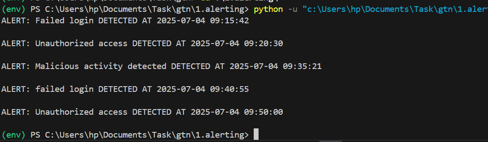
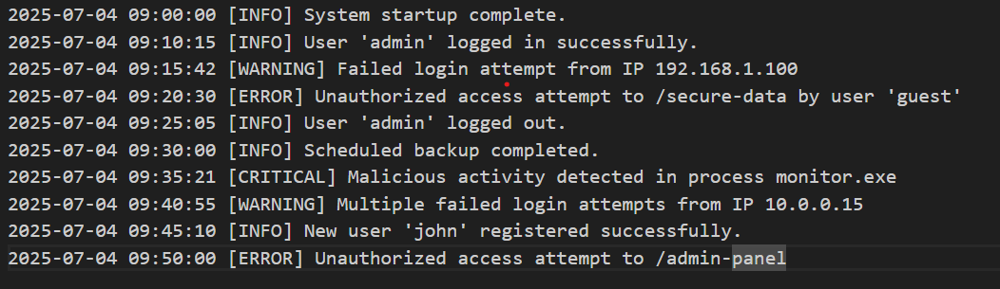
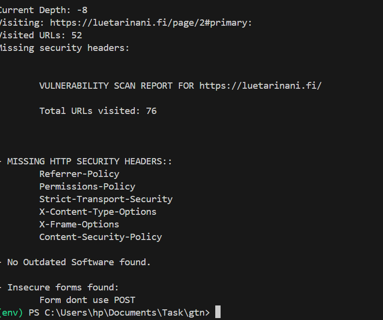

# Assessment Solutions

This repository contains solutions to programming tasks for GreenTick:

## Setup (for Both Solutions)

1. Create and activate a Python virtual environment:
   ```sh
   python -m venv env
   source env/bin/activate  # On linux
   ./env/scripts/activate # on windows
   ```
2. Install dependencies:
   ```sh
   pip install -r requirements.txt
   ```


## 1. SystemMonitor (Log Parsing and Alerting)

### Description
A Python script that reads a log file and identifies error messages or suspicious patterns (e.g., "failed login", "unauthorized access", "malicious activity detected"). When such patterns are detected, the system generates a simple alert with a timestamp.

# note 
when i reasearched log i found that log file are commonly found in format json and csv since Text log file was mentioned in question i used text log file.
and since write a function was meantioned i used python script approach.

### Output Example


### How It Works
- you can define Patterns to detect are defined in `1.alerting/rules.json` with out manually changing code.
- I manually creaated the log "log.txt: and the script reads `1.alerting/log.txt` line by line, checks for matches, and prints alerts accordingly.

### Usage

1. Navigate to the `alerting/` directory:
   ```sh
   cd alerting
   ```
2. Ensure `log.txt` and `rules.json` are present.
3. Run the script:
   ```sh
   python main.py
   ```
4. Alerts will be printed to the console, e.g.:
   ```
   ALERT: unauthorized access DETECTED AT 2025-07-04 09:20:30
   ALERT: Malicious activity detected DETECTED AT 2025-07-04 09:35:21
   ```

### Assumptions & Limitations
- assumed that log file are in this format

- Log file format should include timestamps in `YYYY-MM-DD HH:MM:SS` for.
- Only patterns listed in `rules.json` are detected; you can add more patterns as needed.
- Alerts are printed to the console (not sent elsewhere).


## 2. WebScanCrawler (Web Vulnerability Scanner)

### Description
A Python-based web crawler that scans a website for basic security vulnerabilities:
- Checks for missing HTTP security headers (e.g., Strict-Transport-Security).
- Detects outdated software versions (if visible in headers).
- Finds forms without secure attributes (e.g., missing action or using GET instead of POST).
- Crawls all pages linked from the initial URL (same domain only)used tdlextract to extract domain.


### Output Example


### Usage
1. Navigate to the `webScanCrawler/` directory:
   ```sh
   cd webScanCrawler
   ```
2. Run the script:
   ```sh
   python main.py
   ```
3. Enter the base URL to scan when prompted (e.g., `https://example.com`).
4. The script will crawl the site, print a vulnerability report, and save details to `missing_headers_report.txt` and `form_issues_report.txt`.
( i did it for myself to know which url was generating it)

### Assumptions & Limitations
- Only follows links within the same domain as the base URL.
- Stops after visiting 100 URLs or reaching a depth of 20 to avoid infinite crawling.
- Outdated software detection is based on visible version info in HTTP headers like server and X-.
- Only basic form security checks are performed.
- Requires internet access and the target site to be reachable.
